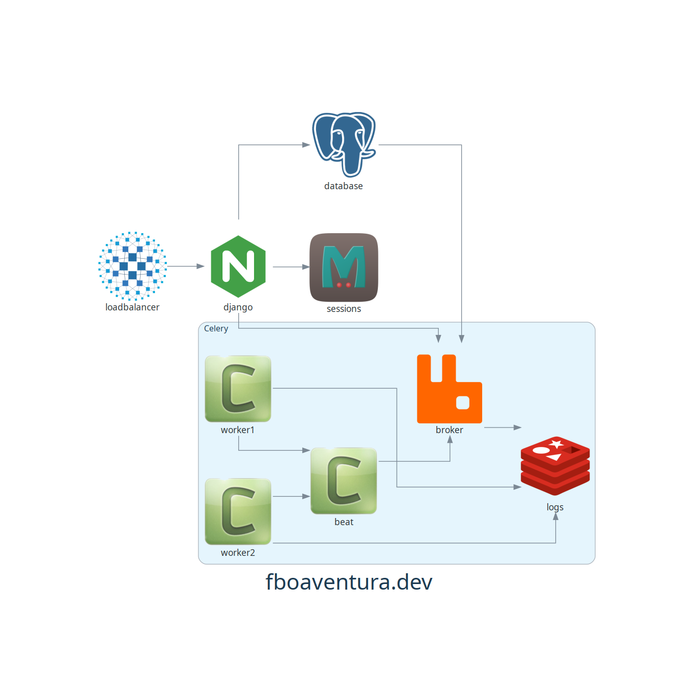

# Diagramas de Infraestrutura por código

É possível automatizar o processo de desenhar mapas de infraestrutura utilizando código.  O módulo [diagrams](https://diagrams.mingrammer.com) é uma biblioteca para Python que faz exatamente isso.

Este repositório tem algumas provas de conceito, onde faço o mapeamento manual e através da leitura de um arquivo `hosts.yml` do Ansible e um `docker-compose.yml`.

Um exemplo de mapa:

