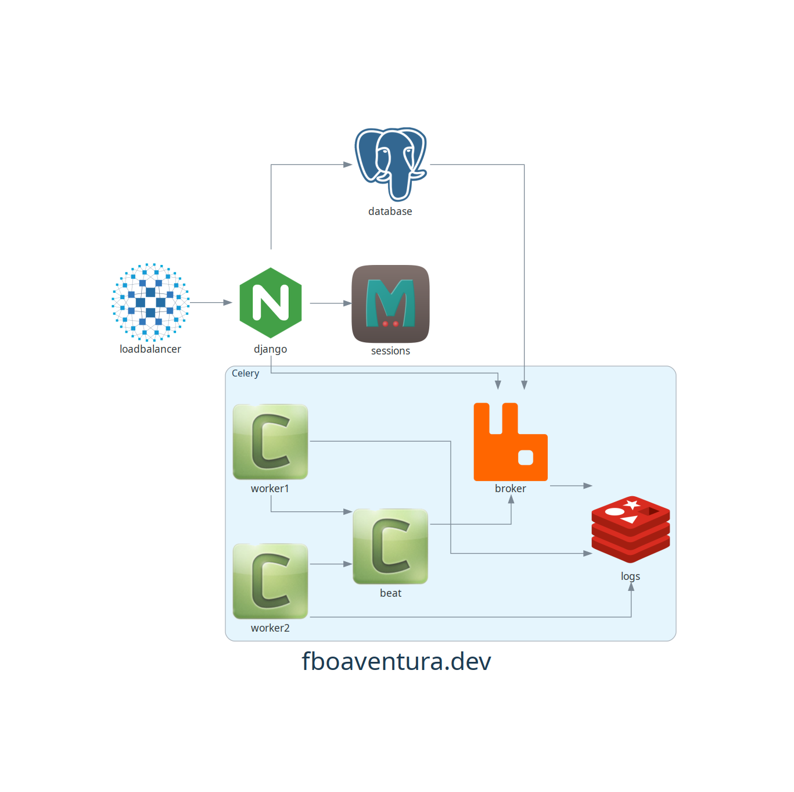
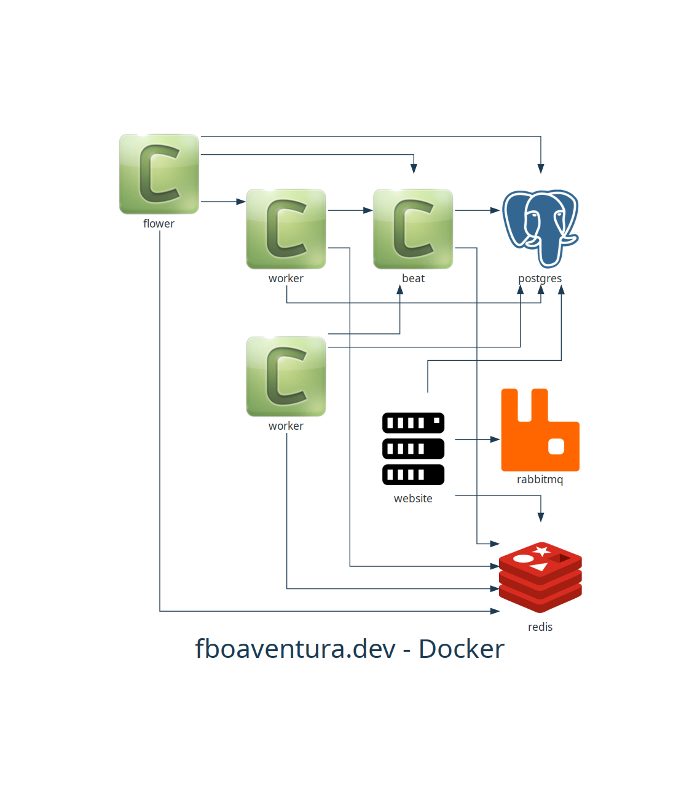

Documentando projetos com código!
=================================

.. toctree::
   :maxdepth: 2
   :caption: Contents:

Indices and tables
==================

* :ref:`genindex`
* :ref:`modindex`
* :ref:`search`

Usando o Terraform Graph
************************

O Terraform_ é uma das ferramentas mais conhecidas, quando se fala em *Infraestrutura como Código*.  O próprio Terraform_ já possui uma opção para gerar um gráfico de conexões entre os recursos utilizados.

O comando é o ``terraform graph`` que gerará uma saída no formato ``dot``, que é um arquivo utilizado pelo Graphviz_ para gerar imagens em diversos formatos, entre eles PNG e SVG.

Para gerar uma imagem em um comando único, primeiro é necessário que o Graphviz_ esteja instalado no sistema. Para testar basta executar:

.. code-block:: bash

   dot -V
   dot - graphviz version 2.43.0 (0)

Estando o Graphviz_ instalado, podemos executar o comando do ``terraform`` completo e já ter a saída direto em uma imagem PNG, SVG ou qualquer outra das suportadas pelo Graphviz_.

.. code-block:: bash

   terraform graph | dot -T png > fboaventuradev_terraform.png

E teremos como resultado a imagem:

.. image:: ../../with_terraform/fboaventuradev_terraform.png

Caso não tenhamos o Graphviz_ instalado, podemos gerar o arquivo ``.dot``, que pode ser utilizado como entrada para o próprio Graphviz_ ou, até mesmo, como arquivo de entrada para um script que gerará a imagem em algum outro contexto.

.. code-block:: bash

   terraform graph > fboaventuradev_terraform.dot

O comando acima gera o arquivo ``.dot`` de saída e o script abaixo faz a leitura do arquivo ``.dot``, gera a saída em ``png`` e abre o arquivo de saída no visualizador padrão do sistema operacional.

.. code-block:: python

   from graphviz import Source
   s = Source.from_file('fboaventuradev_terraform.dot', format='png')
   s.view()

A imagem visualizada será a mesma acima:

.. image:: ../../with_terraform/fboaventuradev_terraform.png

Do ponto de vista da documentação, o gráfico gerado pelo Terraform_ é excelente, uma vez que ele nos mostra todas as ligações entre os recursos utilizados em nossa Infraestrutura.

Entretanto, do ponto de vista prático, não é nada funcional.  Um dos mantras mais conhecidos quando falamos de Infraestrutura como Código é: **IaC não precisa documentar.  O próprio código é a documentação do ambiente.**

Apesar de ser uma verdade, não é **A** verdade.  Algumas vezes, principalmente quando se precisa fazer análise de problema de uma aplicação, é interessante termos um mapa visual, simples e direto das principais conexões do ambiente.  Imagina quanto tempo se perde para fazer este simples levantamento se a cada vez que for necessário, tenha-se que recorrer ao código para saber o que foi alterado, qual é o fluxo dos dados esperado, qual é o real, etc..

Entra o Diagrams
****************

O Diagrams_ é um módulo para o Python que está inserido no mundo ``*-as-Code`` e cuja proposta é justamente possibilitar a construção de diagramas por meio de código.

Um diagrama simples, que mostra um mapa de conectividade de instâncias docker, em um determinado  ambiente.

Pronto! Temos um diagrama mais simples e direto ao ponto, que nos mostra as interconexões entre os containers sem muita poluição visual.  Só existe um problema com esta solução: o código continua sendo manual, ou seja, qualquer alteração no código da Infraestrutura terá que ser replicado no código do gráfico.  E, como bem sabemos, todo processo manual é ainda mais sujeito a erros.

-----------------------------------------------------------------------------------------------

.. automodule:: simple.simple_infra
    :members:

.. function:: simple_main

-----------------------------------------------------------------------------------------------

Eu criei uma pequena Prova de Conceito para duas aplicações, além do desenho manual do diagrama.  A primeira leva em consideração que estamos utilizando o ``docker-compose`` e a segunda para gerenciamento através do ``ansible``.

Diagrams e docker-compose
*************************

É comum o uso do ``docker-compose`` para fazer o gerenciamento de instâncias, tanto locais, quanto no swarm.  O ``docker-compose`` também traz a facilidade de gerenciar todos os serviços relacionados em um *stack* único.

Entretanto, diferente do Terraform_, o ``docker-compose`` não possui uma opção para gerar o gráfico de dependências ou mesmo a documentação do stack.  Mas algumas opções do ``docker-compose`` não alteram, de forma significativa, o funcionamento da aplicação e podem ser utilizadas como "*marcação*" para gerarmos o gráfico utilizando o Diagrams_.

Dentre as opções que podemos utilizar (e que foram utilizadas para este PoC) estão: depends_on_ e a replicas_.  Utilizando estas duas opções no nosso arquivo `docker-compose.yml <../../../with_docker/docker-compose.yml>`_, não alteramos o funcionamento da aplicação e ainda temos as marcações para gerar o gráfico:

O `código <../../../with_docker/docker_infra.py>`_ é simples e bem direto ao ponto, claro possui muito espaço para melhorias, tais como adicionar `Clusters <https://diagrams.mingrammer.com/docs/guides/cluster>`_ para os serviços que possuirem mais de uma instância, ou mesmo para grupos de serviços.

-----------------------------------------------------------------------------------------------

.. automodule:: with_docker.docker_infra
    :members:

.. function:: docker_main

-----------------------------------------------------------------------------------------------

Diagrams e Ansible
******************

Além do Terraform_ e do ``docker-compose`` o Ansible_ também é uma ferramenta bastante utilizada para gestão de configurações e infraestrutura como código.  Ao contrário do ``docker-compose``, o Ansible_ já possui um módulo para gerar o gráfico do `inventário <https://github.com/willthames/ansible-inventory-grapher>`_ e dos `playbooks <https://github.com/haidaraM/ansible-playbook-grapher>`_.  Com o módulo instalado, o comando para gerar o gráfico do inventário é:

.. code-block:: bash

    ansible-inventory-grapher -i hosts.yml -a "rankdir=LR" all | dot -Tpng > fboaventura_dev_ansible_grapher.png

E o resultado:

Está documentado.  Temos o gráfico.  Mas e aí?  Quem está ligado a quem?  Qual é o fluxo das conexões e dos dados?  Afinal, a intenção deste exercício é exatamente ter a visão rápida e clara dos nossos fluxos, certo?

Ainda mais fácil do que o ``docker-compose``, o Ansible nos permite adicionar variáveis ao nosso inventário, que podem ou não ser referenciadas nos playbooks e que, ao fim das contas, não interferem com a execução dos mesmos.  Sendo assim, criei uma lista chamada ``link_to`` onde colocamos as referências dos containers para onde os dados vão, o que é o oposto do depends_on_ do ``docker-compose``.

Ciente da notificação de que a `API <https://docs.ansible.com/ansible/latest/dev_guide/developing_api.html>`_ é voltada apenas para uso interno e que pode mudar a qualquer tempo, vamos em frente com nosso código e o resultado que obtemos é:

-----------------------------------------------------------------------------------------------

.. automodule:: with_ansible.ansible_infra
    :members:

.. function:: ansible_main

-----------------------------------------------------------------------------------------------

.. _Terraform: https://www.terraform.io/
.. _Ansible: https://www.ansible.com
.. _Graphviz: https://www.graphviz.org
.. _Diagrams: https://diagrams.mingrammer.com/
.. _Python: https://python.org
.. _depends_on: https://docs.docker.com/compose/compose-file/#depends_on
.. _replicas: https://docs.docker.com/compose/compose-file/#replicas
